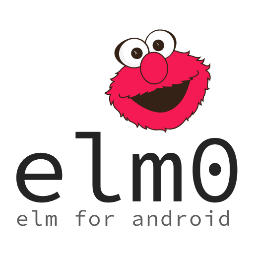

Elmo is the Android framework from Badge that I use for nearly all product development at [Badge](https://badge.app). When I began creating Elmo, my goal was not to create yet another architecture pattern like MVP, MVC,MVVM, it was to allow even a single person to deliver a large scale application easier, faster, and to have fun in the process. 

Elmo will help you write your android applications in a modern, unidirectional and functional way. You will have easy and great tests for free, and you will never have to deal with concurrency and async issues.

I am a firm believer in functional programming, and I know that for many Android developers this is still uncharted territory, but if you keep reading until the end, I promise you that you will rise again, harder and stronger! For what is immutable my never change!

Usage
------

( I am currently working on a tutorial and a blog post about elmo )

License
-------

     Copyright 2019 Borislav Ivanov

    Licensed under the Apache License, Version 2.0 (the "License");
    you may not use this file except in compliance with the License.
    You may obtain a copy of the License at

       http://www.apache.org/licenses/LICENSE-2.0

    Unless required by applicable law or agreed to in writing, software
    distributed under the License is distributed on an "AS IS" BASIS,
    WITHOUT WARRANTIES OR CONDITIONS OF ANY KIND, either express or implied.
    See the License for the specific language governing permissions and
    limitations under the License.

